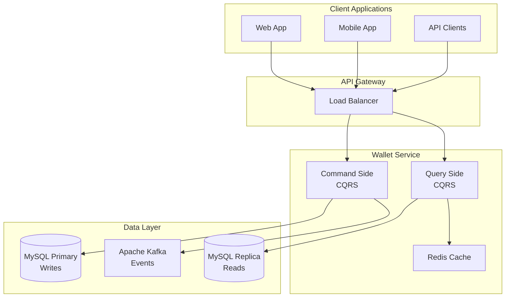

# 💰 Wallet Service

[](https://github.com/your-org/wallet-service/actions)
[](https://codecov.io/gh/your-org/wallet-service)
[](https://pitest.org/)
[](LICENSE)

> A high-performance, scalable digital wallet platform built with modern Java technologies. Designed for Brazilian Real (BRL) transactions.

## 🚀 Quick Start

```bash
# Clone and start everything
git clone https://github.com/your-org/wallet-service
cd wallet-service
docker-compose up -d
./mvnw quarkus:dev
```

🎉 **That's it!** Your development environment is ready at http://localhost:8080


## ✨ Key Features

- **💰 Basic Wallet Operations** - Create, deposit, withdraw, transfer funds

- **⚡ Reactive Programming** - Built with Quarkus and Mutiny for non-blocking operations
- **🏗️ CQRS Structure** - Command/Query separation (implementation in progress)
- **📊 Transaction History** - Historical balance queries via transaction replay
- **🐳 Containerized** - Docker Compose setup for local development
- **🧪 Mutation Testing** - 100% mutation score with PIT testing

> **🚨 [See Implementation Status](docs/implementation-status.md) for honest assessment of what's actually working**

## 🏗️ Architecture

Built with **CQRS**, **Event Sourcing**, and **Reactive Programming**:



## 🎯 Core Operations

### Create Wallet
```bash
curl -X POST http://localhost:8080/api/v1/wallets \
  -H "Content-Type: application/json" \
  -d '{"userId": "user123"}'
```

### Deposit Funds
```bash
curl -X POST http://localhost:8080/api/v1/wallets/{walletId}/deposit \
  -H "Content-Type: application/json" \
  -d '{"amount": "100.00", "referenceId": "dep123", "description": "Initial deposit"}'
```

### Check Balance
```bash
curl http://localhost:8080/api/v1/wallets/{walletId}/balance
```

### Historical Balance
```bash
curl "http://localhost:8080/api/v1/wallets/{walletId}/balance/historical?timestamp=2024-01-01T10:30:00"
```

## 📊 Performance

| Operation | Response Time | Throughput |
|-----------|---------------|------------|
| Balance Query | < 50ms | 10,000 RPS |
| Deposit/Withdraw | < 100ms | 5,000 RPS |
| Transfer | < 150ms | 3,000 RPS |
| Historical Query | < 200ms | 1,000 RPS |

## 🛠️ Technology Stack

- **Framework**: [Quarkus](https://quarkus.io/) - Supersonic Subatomic Java
- **Language**: Java 17 with reactive programming
- **Database**: MySQL 8.0 (Primary-Replica setup)
- **Cache**: Redis 7.0 for high-speed operations
- **Messaging**: Apache Kafka for event streaming
- **Monitoring**: Prometheus + Grafana
- **Testing**: JUnit 5 + PIT Mutation Testing
- **Deployment**: Docker + Kubernetes

## 🚀 Deployment Options

### 🐳 Docker (Recommended for Development)
```bash
docker-compose up -d
```

### ☸️ Kubernetes (Production)
```bash
kubectl apply -f k8s/
```

### 🏃‍♂️ Native Executable
```bash
./mvnw package -Dnative
./target/wallet-service-*-runner
```

## 📚 Documentation

**📖 [Complete Documentation](http://localhost:3001)** (Docsify site)

- **[Architecture Guide](docs/architecture.md)** - System design and patterns
- **[API Reference](docs/api.md)** - Complete REST API documentation  
- **[Development Guide](docs/development.md)** - Local setup and contribution
- **[Testing Strategy](docs/testing.md)** - Comprehensive testing approach
- **[Deployment Guide](docs/deployment.md)** - Production deployment
- **[Architectural Decisions](docs/architectural-decisions.md)** - Why we chose each technology

## 🧪 Quality Assurance

- **Unit Tests**: Basic coverage with JUnit 5
- **Mutation Testing**: 100% score with PIT (for tested classes)
- **Integration Tests**: Limited (in development)
- **Load Testing**: Not yet implemented
- **Security Testing**: Not yet implemented

> **Note**: See [Implementation Status](docs/implementation-status.md) for current testing reality

### Run Tests
```bash
# Unit tests
./mvnw test

# Integration tests  
./mvnw verify

# Mutation testing
./mvnw org.pitest:pitest-maven:mutationCoverage

# All quality checks
./mvnw verify org.pitest:pitest-maven:mutationCoverage
```

## 🔧 Development

### Prerequisites
- Java 17+
- Maven 3.8+
- Docker & Docker Compose

### Local Development
```bash
# Start infrastructure
docker-compose up -d mysql-primary mysql-replica redis kafka

# Run in dev mode with live reload
./mvnw quarkus:dev

# Access dev UI
open http://localhost:8080/q/dev/
```

### Project Structure
```
wallet-service/
├── src/main/java/com/wallet/
│   ├── api/                 # REST endpoints
│   ├── application/         # CQRS commands/queries  
│   ├── domain/              # Domain models & events
│   ├── infrastructure/      # External integrations
│   └── service/             # Application services
├── docs/                    # Docsify documentation
├── k8s/                     # Kubernetes manifests
└── docker-compose.yml       # Local development stack
```

## 🤝 Contributing

We welcome contributions! Please see our [Development Guide](docs/development.md) for:

1. **Fork** the repository
2. **Create** a feature branch
3. **Add** tests for your changes
4. **Ensure** all quality gates pass
5. **Submit** a pull request

### Code Quality Requirements
- ✅ Unit tests (95%+ coverage)
- ✅ Integration tests (critical paths)
- ✅ Mutation tests (100% score)
- ✅ Code style (Google Java Format)
- ✅ Security scan (no high/critical issues)

## 📈 Monitoring

Access monitoring dashboards:
- **Grafana**: http://localhost:3000 (admin/admin)
- **Prometheus**: http://localhost:9090
- **Kafka UI**: http://localhost:8080 (when not conflicting)

## 🔒 Security

- **Encryption**: TLS 1.3 for transport, AES-256 for data at rest
- **Compliance**: OWASP security guidelines
- **Audit**: Complete transaction audit trail

## 📄 License

This project is licensed under the MIT License - see the [LICENSE](LICENSE) file for details.

## 🆘 Support & Community

- **📖 Documentation**: [Docsify Site](http://localhost:3001)
- **🐛 Issues**: [GitHub Issues](https://github.com/your-org/wallet-service/issues)
- **💬 Discussions**: [GitHub Discussions](https://github.com/your-org/wallet-service/discussions)
- **📧 Email**: support@wallet-service.com

## 🎯 Roadmap

- [ ] **Multi-tenant support** - Isolated wallets per organization
- [ ] **Real-time notifications** - WebSocket-based transaction alerts  
- [ ] **Advanced analytics** - ML-powered fraud detection
- [ ] **Mobile SDKs** - Native iOS and Android libraries
- [ ] **Blockchain integration** - Cryptocurrency wallet support

---

**Built with ❤️ by the Wallet Service Team**

*Ready to handle millions of transactions with confidence!* 🚀