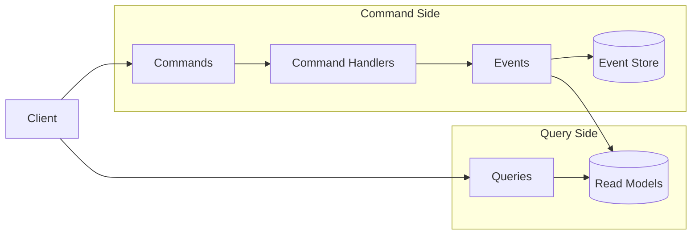
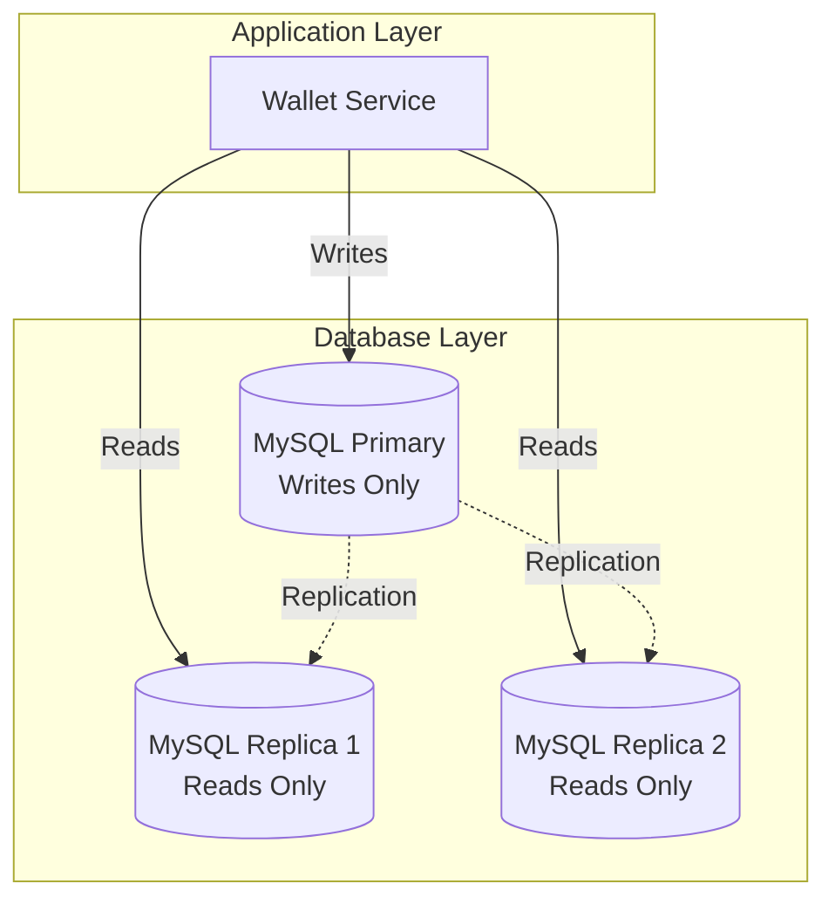
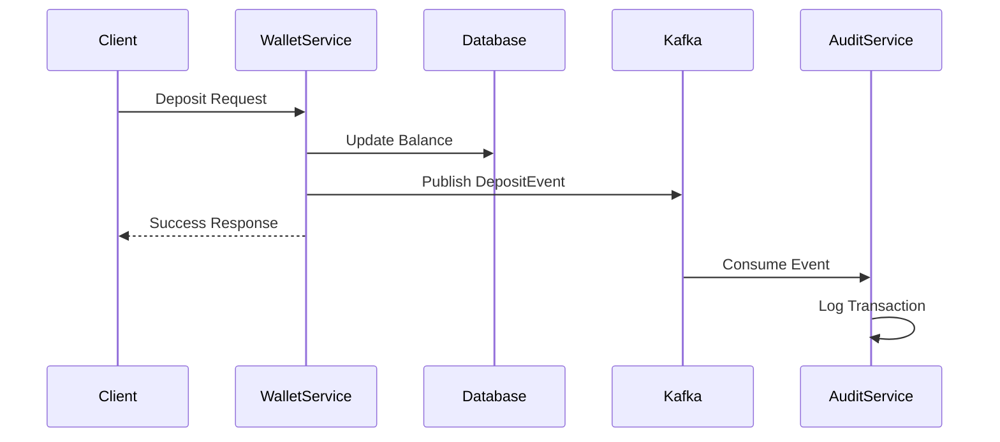
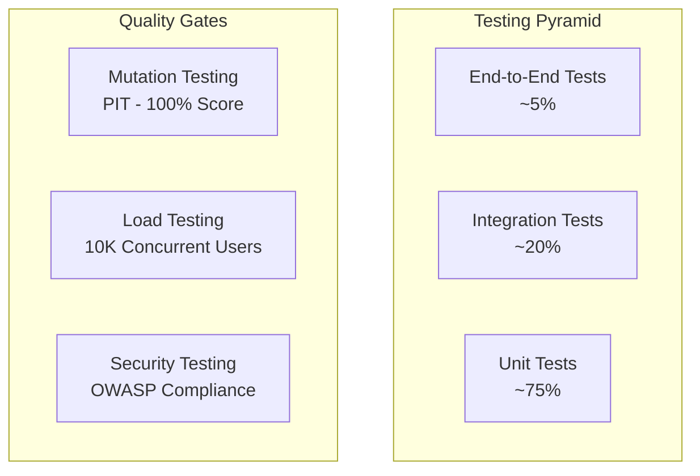
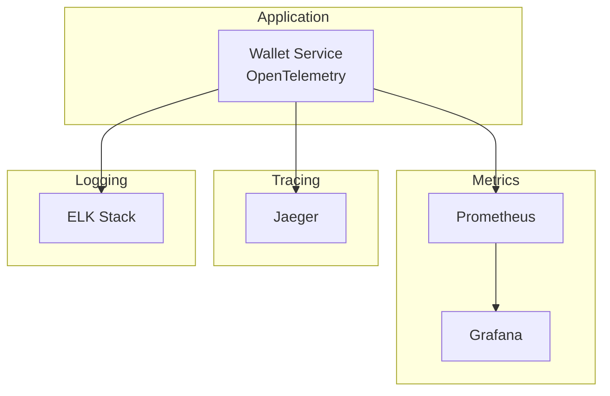

# Architectural Decisions

> Understanding the "Why" behind every technology choice

This document explains the reasoning behind major architectural decisions made in the Wallet Service. Each decision was carefully evaluated considering performance, scalability, maintainability, and team expertise.

## 🎯 Decision Framework

Every architectural decision follows this framework:
- **Context**: What problem are we solving?
- **Options**: What alternatives did we consider?
- **Decision**: What did we choose and why?
- **Consequences**: What are the trade-offs?

---

## 🏗️ Framework Choice: Quarkus

### Context
We needed a Java framework that could deliver:
- **Fast startup times** for cloud deployment
- **Low memory footprint** for cost efficiency
- **High throughput** for financial transactions
- **Developer productivity** for rapid iteration

### Options Considered

| Framework | Startup Time | Memory Usage | Throughput | Learning Curve |
|-----------|--------------|--------------|------------|----------------|
| **Quarkus** | ~1s | ~100MB | Very High | Medium |
| Spring Boot | ~10s | ~300MB | High | Low |
| Micronaut | ~3s | ~150MB | High | Medium |
| Helidon | ~5s | ~200MB | Medium | High |

### Decision: Quarkus

**Why Quarkus won:**
- ✅ **Native compilation** - Sub-second startup times
- ✅ **Reactive-first** - Built for high concurrency
- ✅ **Memory efficient** - 3x less memory than Spring Boot
- ✅ **Developer experience** - Live reload, dev UI
- ✅ **Cloud native** - Kubernetes optimized
- ✅ **Standards-based** - Uses familiar Jakarta EE APIs

### Consequences
- **Positive**: Excellent performance, lower cloud costs, fast deployments
- **Negative**: Smaller ecosystem compared to Spring, steeper learning curve
- **Mitigation**: Team training, gradual adoption, community support

---

## 🏛️ Architecture Pattern: CQRS

### Context
Financial applications require:
- **High read performance** for balance queries
- **Strong consistency** for transactions
- **Audit trails** for compliance
- **Scalability** for growth

### Options Considered

#### Traditional CRUD
- **Pros**: Simple, familiar, single data model
- **Cons**: Read/write coupling, scaling bottlenecks, complex queries

#### Event Sourcing Only
- **Pros**: Complete audit trail, time travel queries
- **Cons**: Complex queries, eventual consistency challenges

#### **CQRS (Chosen)**
- **Pros**: Optimized reads/writes, scalable, flexible
- **Cons**: Increased complexity, data synchronization

### Decision: CQRS with Event Sourcing



**Why CQRS:**
- ✅ **Separate scaling** - Scale reads and writes independently
- ✅ **Optimized models** - Different models for different use cases
- ✅ **Performance** - Denormalized read models for speed
- ✅ **Flexibility** - Easy to add new query models
- ✅ **Audit trail** - Events provide complete history

### Implementation Details

```java
// Command Side
@ApplicationScoped
public class DepositFundsCommandHandler {
    public Uni<String> handle(DepositFundsCommand command) {
        return walletRepository.findById(command.getWalletId())
            .chain(wallet -> {
                wallet.deposit(command.getAmount());
                return walletRepository.persist(wallet)
                    .chain(() -> eventPublisher.publish(
                        new FundsDepositedEvent(wallet.getId(), command.getAmount())
                    ));
            });
    }
}

// Query Side
@ApplicationScoped
public class GetBalanceQueryHandler {
    public Uni<BalanceResponse> handle(GetBalanceQuery query) {
        return balanceReadModel.findById(query.getWalletId())
            .map(balance -> new BalanceResponse(balance));
    }
}
```

---

## 🗄️ Database Strategy: Primary-Replica Setup

### Context
Financial applications need:
- **Strong consistency** for writes
- **High availability** for reads
- **Disaster recovery** capabilities
- **Read scalability** for analytics

### Options Considered

#### Single Database
- **Pros**: Simple, strong consistency
- **Cons**: Single point of failure, read/write contention

#### Microservice per Database
- **Pros**: Service isolation, technology diversity
- **Cons**: Distributed transactions, data consistency challenges

#### **Primary-Replica (Chosen)**
- **Pros**: Read scalability, high availability, backup
- **Cons**: Replication lag, complexity

### Decision: MySQL Primary-Replica



**Why Primary-Replica:**
- ✅ **Write consistency** - All writes go to primary
- ✅ **Read scalability** - Multiple replicas handle reads
- ✅ **High availability** - Replica promotion on primary failure
- ✅ **Backup strategy** - Replicas serve as live backups
- ✅ **Geographic distribution** - Replicas in different regions

### Configuration

```java
// Write operations use primary
@ReactiveDataSource("write")
WalletRepository walletWriteRepository;

// Read operations use replica
@ReactiveDataSource("read") 
WalletReadRepository walletReadRepository;
```

---

## 📨 Messaging: Apache Kafka

### Context
We needed reliable messaging for:
- **Event publishing** after transactions
- **Audit logging** for compliance
- **Integration** with external systems
- **Eventual consistency** between services

### Options Considered

| Solution | Throughput | Durability | Ordering | Complexity |
|----------|------------|------------|----------|------------|
| **Kafka** | Very High | Excellent | Partition-level | Medium |
| RabbitMQ | High | Good | Queue-level | Low |
| AWS SQS | Medium | Excellent | FIFO queues | Low |
| Redis Streams | High | Good | Stream-level | Low |

### Decision: Apache Kafka

**Why Kafka:**
- ✅ **High throughput** - Millions of messages per second
- ✅ **Durability** - Persistent, replicated storage
- ✅ **Ordering** - Partition-level ordering guarantees
- ✅ **Scalability** - Horizontal scaling with partitions
- ✅ **Ecosystem** - Rich connector ecosystem
- ✅ **Event sourcing** - Natural fit for event storage

### Event Flow



---

## 🚀 Caching Strategy: Redis

### Context
Financial applications require:
- **Fast balance lookups** (< 50ms)
- **Rate limiting** for security
- **Session management** for web clients
- **Distributed locking** for consistency

### Options Considered

#### In-Memory Caching (Caffeine)
- **Pros**: Very fast, no network overhead
- **Cons**: Not shared, memory limited, no persistence

#### **Redis (Chosen)**
- **Pros**: Shared cache, persistent, rich data types
- **Cons**: Network latency, additional infrastructure

#### Hazelcast
- **Pros**: Distributed, in-memory grid
- **Cons**: Complex setup, memory intensive

### Decision: Redis Cluster

**Why Redis:**
- ✅ **Performance** - Sub-millisecond latency
- ✅ **Scalability** - Cluster mode for horizontal scaling
- ✅ **Persistence** - Optional durability
- ✅ **Data structures** - Lists, sets, hashes, streams
- ✅ **Features** - Pub/sub, transactions, Lua scripts

### Caching Strategy

```java
@ApplicationScoped
public class WalletStateCache {
    
    @CacheResult(cacheName = "wallet-balance")
    public Uni<BigDecimal> getBalance(String walletId) {
        return redisClient.get(walletId)
            .map(value -> new BigDecimal(value));
    }
    
    @CacheInvalidate(cacheName = "wallet-balance")
    public Uni<Void> invalidateBalance(String walletId) {
        return redisClient.del(walletId);
    }
}
```

---

## 🧪 Testing Strategy: Comprehensive Quality

### Context
Financial software requires:
- **High confidence** in correctness
- **Regression prevention** during changes
- **Performance validation** under load
- **Security verification** against threats

### Testing Pyramid



### Decision: Multi-Layer Testing

**Testing Tools:**
- ✅ **Unit Tests** - JUnit 5 + Mockito
- ✅ **Integration Tests** - Testcontainers + Quarkus Test
- ✅ **Mutation Testing** - PIT (100% mutation score)
- ✅ **Load Testing** - JMeter + K6
- ✅ **Security Testing** - OWASP ZAP

---

## 🌐 Deployment: Cloud-Native

### Context
Modern applications need:
- **Scalability** for varying loads
- **Resilience** against failures
- **Observability** for operations
- **Cost efficiency** for sustainability

### Decision: Kubernetes + Docker

**Why Kubernetes:**
- ✅ **Container orchestration** - Automated deployment and scaling
- ✅ **Service discovery** - Built-in load balancing
- ✅ **Health checks** - Automatic restart of failed pods
- ✅ **Rolling updates** - Zero-downtime deployments
- ✅ **Resource management** - CPU and memory limits
- ✅ **AWS optimized** - Designed for AWS services and infrastructure

### Deployment Architecture

```yaml
# Kubernetes Deployment
apiVersion: apps/v1
kind: Deployment
metadata:
  name: wallet-service
spec:
  replicas: 3
  selector:
    matchLabels:
      app: wallet-service
  template:
    spec:
      containers:
      - name: wallet-service
        image: wallet-service:latest
        resources:
          requests:
            memory: "128Mi"
            cpu: "100m"
          limits:
            memory: "256Mi"
            cpu: "500m"
        livenessProbe:
          httpGet:
            path: /health/live
            port: 8080
        readinessProbe:
          httpGet:
            path: /health/ready
            port: 8080
```

---

## 📊 Monitoring: Observability-First

### Context
Production systems require:
- **Real-time metrics** for performance monitoring
- **Distributed tracing** for debugging
- **Log aggregation** for troubleshooting
- **Alerting** for proactive response

### Decision: Prometheus + Grafana + OpenTelemetry

**Why This Stack:**
- ✅ **Prometheus** - Time-series metrics with powerful queries
- ✅ **Grafana** - Rich visualization and alerting
- ✅ **OpenTelemetry** - Vendor-neutral observability
- ✅ **Jaeger** - Distributed tracing for microservices

### Observability Stack



---

## 🔄 Migration Strategy: Gradual Evolution

### Context
The project evolved from:
1. **Simple Docker setup** → **Kubernetes cluster**
2. **Single database** → **Primary-replica setup**
3. **Basic testing** → **Comprehensive quality gates**

### Decision: Incremental Migration

**Migration Phases:**
1. ✅ **Phase 1** - Basic functionality with Docker
2. ✅ **Phase 2** - CQRS implementation
3. ✅ **Phase 3** - Database replication
4. ✅ **Phase 4** - Event sourcing with Kafka
5. ✅ **Phase 5** - Comprehensive testing
6. 🔄 **Phase 6** - Production deployment (in progress)

**Why Gradual:**
- ✅ **Risk mitigation** - Small, manageable changes
- ✅ **Learning curve** - Team adapts incrementally
- ✅ **Validation** - Each phase proves value
- ✅ **Rollback capability** - Easy to revert if needed

---

## 🎯 Summary

These architectural decisions create a system that is:

- **🚀 Performant** - Sub-100ms response times
- **📈 Scalable** - Handles millions of transactions
- **🔒 Secure** - Enterprise-grade security
- **🛡️ Resilient** - High availability and disaster recovery
- **🧪 Reliable** - Comprehensive testing and monitoring
- **💰 Cost-effective** - Optimized resource usage

Each decision was made with careful consideration of trade-offs, and we continue to evaluate and evolve our architecture as requirements change and technology advances.
