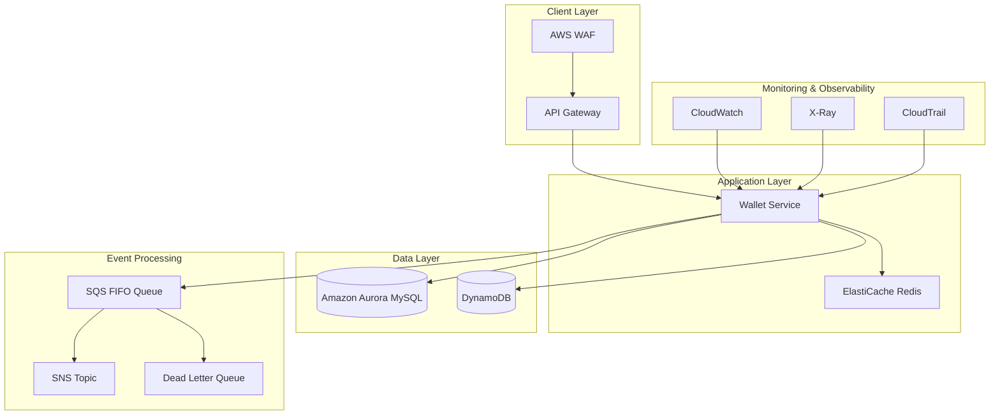
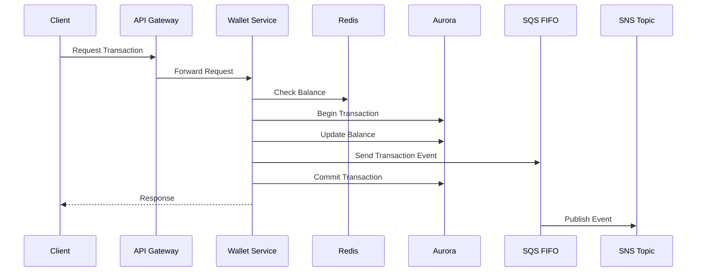

# Architecture Design

## Overview

The Wallet Service is designed following AWS Well-Architected Framework principles, ensuring high availability, scalability, and security for financial transactions.

## System Architecture

## Transaction Flow

## Core Components

### API Layer
- **AWS API Gateway**
  - RESTful API endpoints
  - Request/response transformation
  - API versioning
  - Throttling controls

- **AWS WAF**
  - DDoS protection
  - SQL injection prevention
  - Rate limiting
  - IP blocking

### Application Layer
- **Quarkus Application**
  - Reactive programming model
  - Native compilation support
  - Fast startup time
  - Low memory footprint

- **ElastiCache Redis**
  - Balance caching
  - Rate limiting
  - Distributed locking
  - Session management

### Data Layer
- **Amazon Aurora MySQL**
  - Primary transaction database
  - ACID compliance
  - Automated backups
  - Read replicas

- **Amazon DynamoDB**
  - Historical data storage
  - Audit logging
  - High-speed queries
  - Auto-scaling

### Event Processing
- **Amazon SQS FIFO**
  - Ordered message delivery
  - Exactly-once processing
  - Dead letter queues
  - Message retention

- **Amazon SNS**
  - Event notifications
  - Multiple subscribers
  - Message filtering
  - Delivery retries

## Scalability & Performance

### Horizontal Scaling
- Auto-scaling groups for application layer
- Read replicas for Aurora
- On-demand scaling for DynamoDB

### Caching Strategy
- Redis for hot data
- Write-through caching
- Cache invalidation patterns
- TTL management

### Performance Optimization
- Connection pooling
- Query optimization
- Batch processing
- Asynchronous operations

## High Availability & Disaster Recovery

### Multi-AZ Deployment
- Active-active configuration
- Automated failover
- Load balancing
- Health checks

### Backup & Recovery
- Continuous backup for Aurora
- Point-in-time recovery
- Cross-region replication
- Regular DR testing

## Monitoring & Alerting

### Metrics Collection
- Custom CloudWatch metrics
- Performance monitoring
- Error tracking
- Business metrics

### Alerting Strategy
- Multi-level alerting
- PagerDuty integration
- Automated responses
- Escalation policies

## Cost Optimization

### Resource Management
- Auto-scaling policies
- Right-sizing instances
- Reserved instances
- Spot instances where applicable

### Cost Monitoring
- Budget alerts
- Usage tracking
- Cost allocation tags
- Regular optimization reviews
