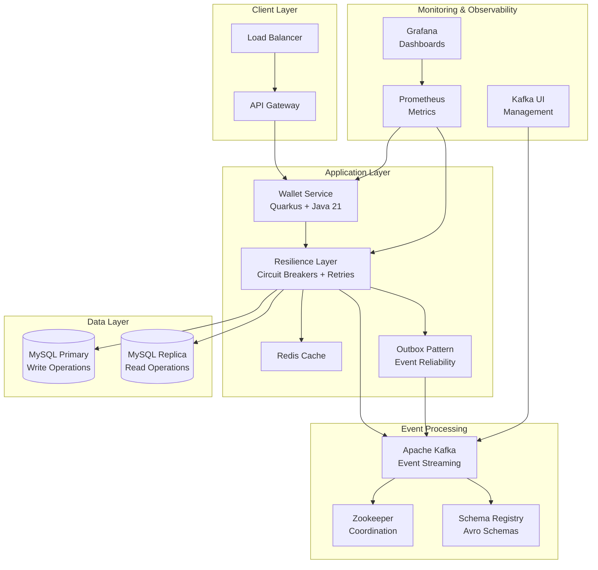
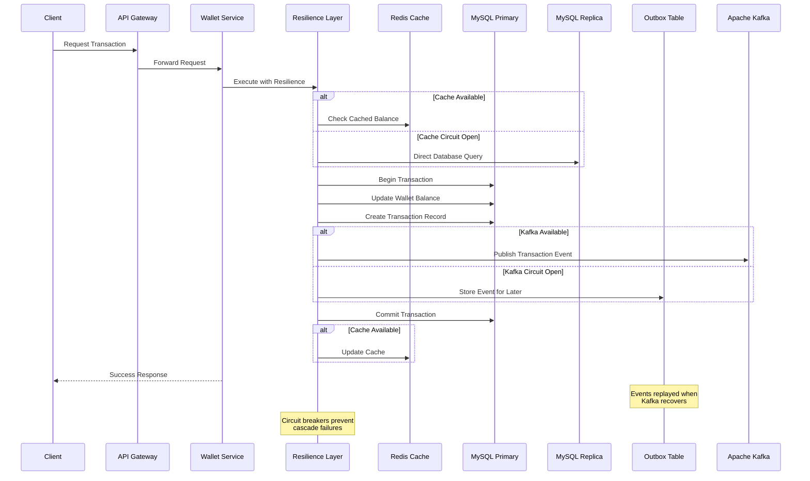

# System Architecture

> Comprehensive guide to the Wallet Service architecture and design patterns

## 🎯 Overview

The Wallet Service is designed as a **cloud-native, event-driven microservice** following modern architectural patterns. Built with **CQRS**, **Event Sourcing**, and **Reactive Programming**, it delivers high performance and scalability for financial applications.

### 🏗️ Architectural Principles

- **🔄 CQRS** - Separate read and write models for optimal performance
- **📝 Event Sourcing** - Complete audit trail with event-driven state changes  
- **⚡ Reactive Programming** - Non-blocking, high-concurrency operations
- **🌐 Cloud Native** - Designed for containerized, distributed environments

- **📊 Observability** - Comprehensive monitoring and tracing

## System Architecture

## Transaction Flow

## Core Components

### API Layer
- **Load Balancer**
  - Traffic distribution
  - Health checks
  - SSL termination
  - High availability

- **API Gateway**
  - RESTful API endpoints
  - Request/response validation
  - Rate limiting

### Application Layer
- **Quarkus Application**
  - Reactive programming with Mutiny
  - Native compilation support
  - Sub-second startup time
  - Low memory footprint (~100MB)
  - CQRS architecture implementation

- **Redis Cache**
  - Balance caching (sub-ms latency)
  - Session management
  - Rate limiting counters
  - Distributed locking

### Data Layer
- **MySQL Primary**
  - Write operations
  - ACID compliance
  - Transaction consistency
  - Automated backups

- **MySQL Replica**
  - Read operations
  - Query performance
  - Load distribution
  - High availability

### Event Processing
- **Apache Kafka**
  - Event streaming
  - Durable message storage
  - Partition-level ordering
  - High throughput (millions msg/sec)

- **Zookeeper**
  - Kafka cluster coordination
  - Configuration management
  - Leader election
  - Service discovery

- **Schema Registry**
  - Avro schema management
  - Schema evolution
  - Compatibility checking
  - Serialization optimization

## Scalability & Performance

### Horizontal Scaling
- Auto-scaling groups for application layer
- Read replicas for Aurora
- On-demand scaling for DynamoDB

### Caching Strategy
- Redis for hot data
- Write-through caching
- Cache invalidation patterns
- TTL management

### Performance Optimization
- Connection pooling
- Query optimization
- Batch processing
- Asynchronous operations

## High Availability & Disaster Recovery

### Multi-AZ Deployment
- Active-active configuration
- Automated failover
- Load balancing
- Health checks

### Backup & Recovery
- Continuous backup for Aurora
- Point-in-time recovery
- Cross-region replication
- Regular DR testing

## Monitoring & Alerting

### Metrics Collection
- Custom CloudWatch metrics
- Performance monitoring
- Error tracking
- Business metrics

### Alerting Strategy
- Multi-level alerting
- PagerDuty integration
- Automated responses
- Escalation policies

## Cost Optimization

### Resource Management
- Auto-scaling policies
- Right-sizing instances
- Reserved instances
- Spot instances where applicable

### Cost Monitoring
- Budget alerts
- Usage tracking
- Cost allocation tags
- Regular optimization reviews
