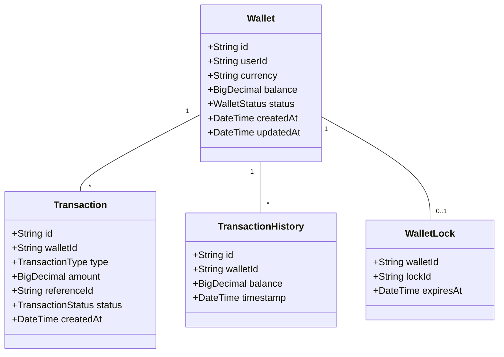

# Data Model

## Overview

The Wallet Service uses a hybrid data storage approach, combining Amazon Aurora MySQL for transactional data and Amazon DynamoDB for historical and audit data.

## Entity Relationship Diagram



## Aurora MySQL Schema

### Wallet Table

```sql
CREATE TABLE wallet (
    id VARCHAR(36) PRIMARY KEY,
    user_id VARCHAR(36) NOT NULL,
    currency VARCHAR(3) NOT NULL,
    balance DECIMAL(19,4) NOT NULL DEFAULT 0.0000,
    status ENUM('ACTIVE', 'FROZEN', 'CLOSED') NOT NULL DEFAULT 'ACTIVE',
    created_at TIMESTAMP NOT NULL DEFAULT CURRENT_TIMESTAMP,
    updated_at TIMESTAMP NOT NULL DEFAULT CURRENT_TIMESTAMP ON UPDATE CURRENT_TIMESTAMP,
    INDEX idx_user_id (user_id),
    INDEX idx_status (status)
) ENGINE=InnoDB;
```

### Transaction Table

```sql
CREATE TABLE transaction (
    id VARCHAR(36) PRIMARY KEY,
    wallet_id VARCHAR(36) NOT NULL,
    type ENUM('DEPOSIT', 'WITHDRAWAL', 'TRANSFER') NOT NULL,
    amount DECIMAL(19,4) NOT NULL,
    reference_id VARCHAR(36) NOT NULL,
    status ENUM('PENDING', 'COMPLETED', 'FAILED', 'REVERSED') NOT NULL,
    description TEXT,
    created_at TIMESTAMP NOT NULL DEFAULT CURRENT_TIMESTAMP,
    FOREIGN KEY (wallet_id) REFERENCES wallet(id),
    UNIQUE INDEX idx_reference_id (reference_id),
    INDEX idx_wallet_id (wallet_id),
    INDEX idx_created_at (created_at)
) ENGINE=InnoDB;
```

## DynamoDB Tables

### TransactionHistory Table

```json
{
  "TableName": "TransactionHistory",
  "KeySchema": [
    {
      "AttributeName": "wallet_id",
      "KeyType": "HASH"
    },
    {
      "AttributeName": "timestamp",
      "KeyType": "RANGE"
    }
  ],
  "AttributeDefinitions": [
    {
      "AttributeName": "wallet_id",
      "AttributeType": "S"
    },
    {
      "AttributeName": "timestamp",
      "AttributeType": "N"
    }
  ],
  "ProvisionedThroughput": {
    "ReadCapacityUnits": 10,
    "WriteCapacityUnits": 10
  },
  "GlobalSecondaryIndexes": [
    {
      "IndexName": "by_timestamp",
      "KeySchema": [
        {
          "AttributeName": "timestamp",
          "KeyType": "HASH"
        }
      ],
      "Projection": {
        "ProjectionType": "ALL"
      }
    }
  ]
}
```

### WalletLock Table

```json
{
  "TableName": "WalletLock",
  "KeySchema": [
    {
      "AttributeName": "wallet_id",
      "KeyType": "HASH"
    }
  ],
  "AttributeDefinitions": [
    {
      "AttributeName": "wallet_id",
      "AttributeType": "S"
    }
  ],
  "ProvisionedThroughput": {
    "ReadCapacityUnits": 10,
    "WriteCapacityUnits": 10
  },
  "TimeToLiveSpecification": {
    "AttributeName": "expires_at",
    "Enabled": true
  }
}
```

## Data Access Patterns

### Primary Access Patterns

1. **Get Wallet Balance**
   - Direct lookup by wallet_id in Wallet table
   - Cached in Redis for high-frequency reads

2. **Update Balance**
   - Transactional update in Wallet table
   - Optimistic locking using updated_at
   - Cache invalidation

3. **Historical Balance**
   - Query TransactionHistory by wallet_id and timestamp
   - Uses GSI for efficient time-based queries

4. **Transaction History**
   - Query Transaction table by wallet_id
   - Pagination using created_at index

### Consistency Considerations

1. **Strong Consistency**
   - All balance updates
   - Transaction status changes
   - Wallet status changes

2. **Eventually Consistent**
   - Historical balance queries
   - Analytics data
   - Audit logs

## Cache Strategy

### Redis Cache Structure

1. **Balance Cache**
```
Key: wallet:{wallet_id}:balance
Value: {
  "balance": "100.50",
  "currency": "USD",
  "updated_at": "2024-03-21T10:30:00Z"
}
TTL: 300 seconds
```

2. **Rate Limiting**
```
Key: ratelimit:{wallet_id}:{operation}
Value: Counter
TTL: 60 seconds
```

3. **Distributed Lock**
```
Key: lock:{wallet_id}
Value: {lock_id}
TTL: 30 seconds
```

## Data Migration Strategy

1. **Schema Updates**
   - Blue-green deployment
   - Forward/backward compatibility
   - Feature flags for gradual rollout

2. **Data Backfill**
   - Batch processing
   - Progress tracking
   - Validation checksums

## Backup Strategy

1. **Aurora Backups**
   - Continuous backup
   - Point-in-time recovery
   - Cross-region replication

2. **DynamoDB Backups**
   - On-demand backups
   - Point-in-time recovery
   - Global tables for DR
