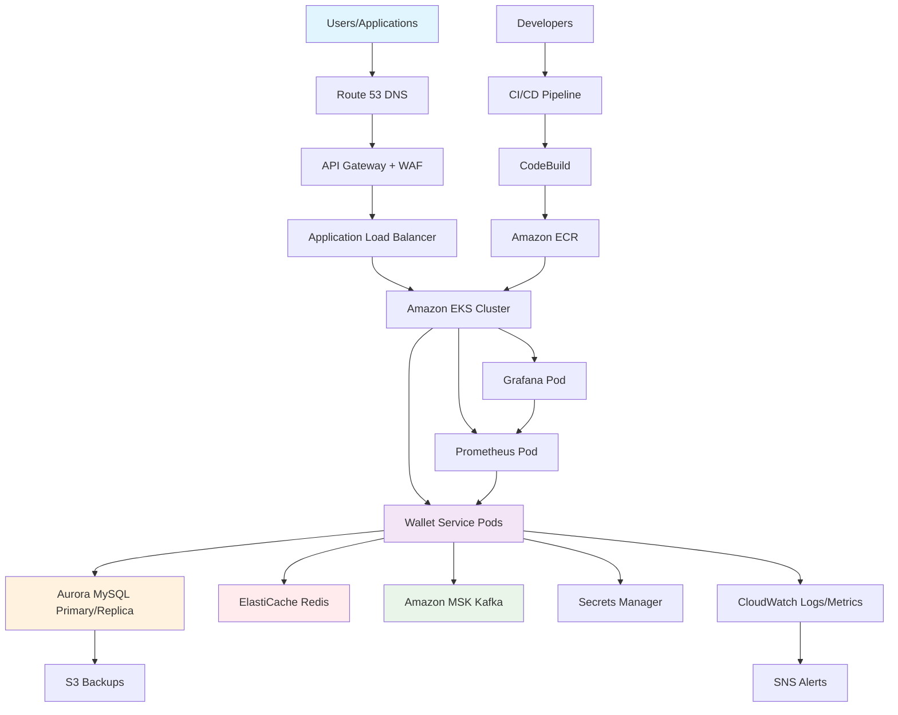
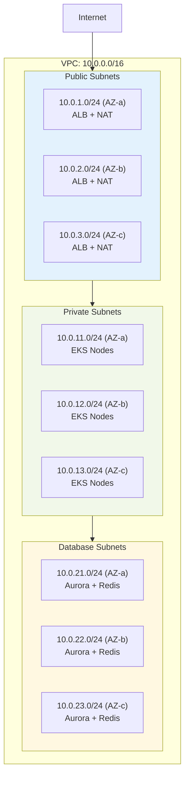
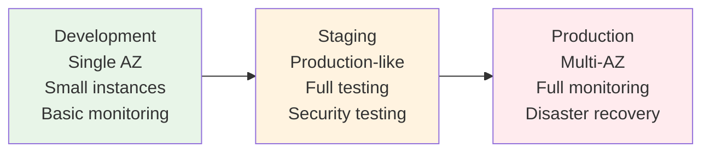

# AWS Production Architecture

> **Complete AWS deployment architecture for the Wallet Service**

## 🎯 Architecture Overview

The Wallet Service is designed for **enterprise-grade deployment on AWS** with high availability, security, and scalability. This architecture leverages managed AWS services to minimize operational overhead while maximizing performance and reliability.

## 🏗️ Complete AWS Architecture Diagram

## 🛠️ AWS Services Breakdown

### **🌐 API & Security Layer**

#### **Amazon API Gateway**
- **Purpose**: REST API management, authentication, rate limiting
- **Features**: 
  - Request/response transformation
  - API key management
  - Usage plans and throttling
  - CORS handling
- **Integration**: Direct integration with Application Load Balancer

#### **AWS WAF (Web Application Firewall)**
- **Purpose**: Protection against common web exploits
- **Features**:
  - DDoS protection
  - SQL injection prevention
  - Cross-site scripting (XSS) protection
  - IP whitelisting/blacklisting
  - Rate limiting by IP/API key

### **☸️ Compute Layer**

#### **Amazon EKS (Elastic Kubernetes Service)**
- **Purpose**: Managed Kubernetes for containerized applications
- **Configuration**:
  - **Node Groups**: Auto-scaling worker nodes (t3.medium to start)
  - **Pod Autoscaling**: Horizontal Pod Autoscaler (HPA)
  - **Cluster Autoscaling**: Automatic node scaling
  - **Networking**: VPC CNI for pod networking
- **Benefits**:
  - Managed control plane
  - Automatic security patches
  - Integration with AWS services
  - Rolling deployments

#### **Application Load Balancer (ALB)**
- **Purpose**: Distribute traffic across EKS pods
- **Features**:
  - Health checks
  - SSL termination
  - Path-based routing
  - Integration with EKS Ingress

### **🗄️ Data Layer**

#### **Amazon Aurora MySQL**
- **Purpose**: Primary database with read replicas
- **Configuration**:
  - **Writer Instance**: db.r6g.large (primary)
  - **Reader Instances**: 2x db.r6g.large (replicas)
  - **Storage**: Auto-scaling from 10GB to 128TB
  - **Backups**: Automated daily backups, 7-day retention
- **Features**:
  - **CQRS Support**: Write to primary, read from replicas
  - **High Availability**: Multi-AZ deployment
  - **Performance**: Up to 5x faster than standard MySQL
  - **Security**: Encryption at rest and in transit

#### **Amazon ElastiCache for Redis**
- **Purpose**: High-performance caching layer
- **Configuration**:
  - **Instance Type**: cache.r6g.large
  - **Cluster Mode**: Enabled for scaling
  - **Replicas**: 2 read replicas per shard
- **Features**:
  - Sub-millisecond latency
  - Automatic failover
  - Backup and restore
  - Encryption in transit and at rest

#### **Amazon MSK (Managed Streaming for Kafka)**
- **Purpose**: Event streaming and event sourcing
- **Configuration**:
  - **Broker Type**: kafka.m5.large
  - **Brokers**: 3 brokers across 3 AZs
  - **Storage**: 100GB EBS per broker
- **Features**:
  - Fully managed Kafka
  - Auto-scaling storage
  - Monitoring integration
  - Security with IAM and VPC

### **🔐 Security & Configuration**

#### **AWS Secrets Manager**
- **Purpose**: Secure storage of sensitive credentials
- **Secrets Stored**:
  - Aurora database passwords
  - Redis authentication tokens
  - Kafka certificates
  - API keys and tokens
- **Features**:
  - Automatic rotation
  - Fine-grained access control
  - Encryption at rest

#### **AWS Systems Manager Parameter Store**
- **Purpose**: Application configuration management
- **Parameters**:
  - Database connection strings
  - Cache configuration
  - Kafka topics and settings
  - Feature flags
- **Benefits**:
  - Hierarchical organization
  - Version tracking
  - Integration with EKS

#### **IAM Roles and Policies**
- **EKS Service Role**: Cluster management permissions
- **Node Group Role**: EC2 and ECR access
- **Pod Roles**: Service-specific permissions via IRSA
- **Application Role**: Aurora, ElastiCache, MSK, Secrets Manager access

### **📊 Monitoring & Observability**

#### **Amazon CloudWatch**
- **Purpose**: Centralized logging and monitoring
- **Components**:
  - **Logs**: Application logs, EKS logs, Aurora logs
  - **Metrics**: Custom business metrics, infrastructure metrics
  - **Alarms**: Performance and error rate alerting
  - **Dashboards**: Real-time monitoring views

#### **AWS X-Ray**
- **Purpose**: Distributed tracing across services
- **Features**:
  - Request tracing through API Gateway → EKS → Aurora
  - Performance bottleneck identification
  - Service map visualization
  - Error analysis

#### **Prometheus + Grafana (On EKS)**
- **Purpose**: Advanced metrics and custom dashboards
- **Deployment**: Helm charts on EKS cluster
- **Integration**: Scrapes custom wallet metrics
- **Benefits**: Detailed business metrics visualization

### **🐳 Container & Deployment**

#### **Amazon ECR (Elastic Container Registry)**
- **Purpose**: Private Docker image registry
- **Features**:
  - Vulnerability scanning
  - Image lifecycle policies
  - Integration with EKS
  - Cross-region replication

#### **CI/CD Pipeline**
- **CI/CD Pipeline**: Source code management and automated deployment
- **AWS CodeBuild**: Docker image building
- **Deployment Flow**:
  1. Code push to GitHub
  2. CI/CD pipeline triggers build
  3. CodeBuild creates Docker image
  4. Push to ECR
  5. Deploy to EKS via kubectl/Helm

## 🌍 Network Architecture

### **VPC Configuration**

### **Security Groups**
- **ALB Security Group**: Allow HTTP/HTTPS from internet
- **EKS Security Group**: Allow traffic from ALB, internal communication
- **Aurora Security Group**: Allow MySQL (3306) from EKS only
- **ElastiCache Security Group**: Allow Redis (6379) from EKS only
- **MSK Security Group**: Allow Kafka (9092) from EKS only

## 💰 Cost Optimization

### **Estimated Monthly Costs (us-east-1)**

| Service | Configuration | Monthly Cost |
|---------|---------------|--------------|
| **EKS Cluster** | Control plane | $73 |
| **EC2 Instances** | 3x t3.medium nodes | $95 |
| **Aurora MySQL** | 1 writer + 2 readers | $350 |
| **ElastiCache Redis** | cache.r6g.large cluster | $180 |
| **MSK** | 3x kafka.m5.large brokers | $450 |
| **API Gateway** | 1M requests/month | $3.50 |
| **ALB** | Standard load balancer | $23 |
| **CloudWatch** | Logs + metrics | $50 |
| **Other Services** | ECR, Secrets Manager, etc. | $30 |
| **Total** | **Estimated** | **~$1,255/month** |

### **Cost Optimization Strategies**
- **Reserved Instances**: 30-50% savings on EC2 and Aurora
- **Spot Instances**: Use for non-critical EKS nodes
- **Auto-scaling**: Scale down during low usage
- **Storage Optimization**: Lifecycle policies for logs and backups

## 🚀 Deployment Strategy

### **Environment Strategy**

### **Blue-Green Deployment**
- **Blue Environment**: Current production
- **Green Environment**: New version deployment
- **Switch**: DNS/ALB target group switch
- **Rollback**: Instant switch back to blue

## 📈 Scaling Strategy

### **Horizontal Scaling**
- **EKS Pods**: HPA based on CPU/memory/custom metrics
- **EKS Nodes**: Cluster Autoscaler
- **Aurora**: Read replica auto-scaling
- **ElastiCache**: Cluster mode scaling

### **Vertical Scaling**
- **Database**: Aurora auto-scaling storage
- **Cache**: ElastiCache node type upgrades
- **Compute**: EKS node type upgrades

## 🔒 Security Best Practices

### **Network Security**
- **VPC**: Private subnets for all data services
- **Security Groups**: Principle of least privilege
- **NACLs**: Additional network layer protection
- **VPC Endpoints**: Private connectivity to AWS services

### **Data Security**
- **Encryption at Rest**: All data services encrypted
- **Encryption in Transit**: TLS 1.2+ everywhere
- **Key Management**: AWS KMS for encryption keys
- **Backup Encryption**: Encrypted backups and snapshots

### **Access Security**
- **IAM**: Role-based access control
- **IRSA**: Pod-level permissions in EKS
- **Secrets**: No hardcoded credentials
- **Audit**: CloudTrail for all API calls

## 🎯 High Availability & Disaster Recovery

### **High Availability**
- **Multi-AZ**: All services across 3 availability zones
- **Auto-failover**: Aurora and ElastiCache automatic failover
- **Health Checks**: EKS pod health checks and auto-restart
- **Load Balancing**: Traffic distribution across healthy instances

### **Disaster Recovery**
- **RTO**: Recovery Time Objective < 15 minutes
- **RPO**: Recovery Point Objective < 5 minutes
- **Backups**: Automated daily backups with cross-region replication
- **Runbooks**: Documented disaster recovery procedures

## 📋 Implementation Checklist

### **Phase 1: Core Infrastructure**
- [ ] VPC and networking setup
- [ ] EKS cluster creation
- [ ] Aurora MySQL cluster
- [ ] ElastiCache Redis cluster
- [ ] MSK Kafka cluster

### **Phase 2: Security & Access**
- [ ] IAM roles and policies
- [ ] Secrets Manager setup
- [ ] Parameter Store configuration
- [ ] Security groups and NACLs

### **Phase 3: Application Deployment**
- [ ] ECR repository creation
- [ ] Docker image build and push
- [ ] EKS application deployment
- [ ] API Gateway configuration

### **Phase 4: Monitoring & Operations**
- [ ] CloudWatch setup
- [ ] Prometheus/Grafana deployment
- [ ] Alerting configuration
- [ ] CI/CD pipeline setup

### **Phase 5: Testing & Go-Live**
- [ ] Performance testing
- [ ] Security testing
- [ ] Disaster recovery testing
- [ ] Production deployment

## 🎉 Benefits of This Architecture

### **Performance**
- **Sub-20ms response times** maintained with AWS managed services
- **Auto-scaling** handles traffic spikes automatically
- **Global reach** with CloudFront CDN (optional)

### **Reliability**
- **99.99% uptime** with multi-AZ deployment
- **Automatic failover** for all data services
- **Self-healing** with Kubernetes health checks

### **Security**
- **Enterprise-grade** security with WAF and API Gateway
- **Compliance ready** with encryption and audit trails
- **Zero-trust** network architecture

### **Operational Excellence**
- **Fully managed** services reduce operational overhead
- **Automated** deployments and scaling
- **Comprehensive** monitoring and alerting

---

**This architecture provides enterprise-grade hosting for the Wallet Service with exceptional performance, security, and reliability on AWS!** 🚀
