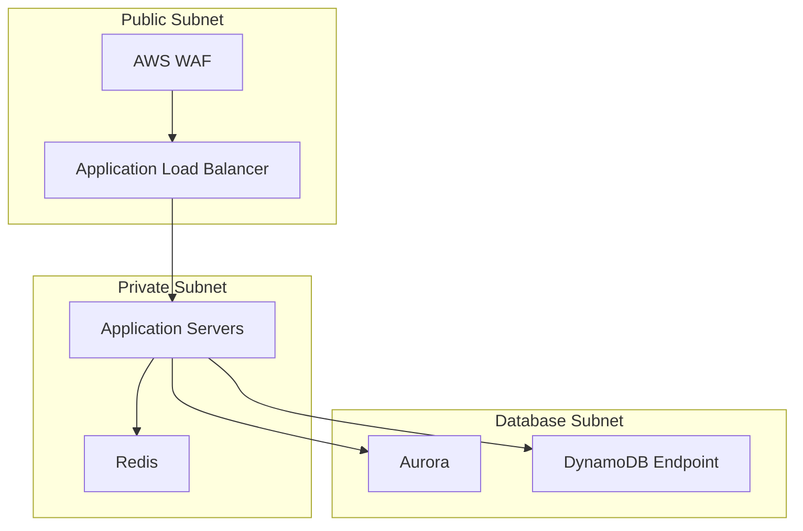

# Security & Compliance

## Overview

The Wallet Service implements comprehensive security measures to protect financial transactions and user data, following industry best practices and regulatory requirements.

## Authentication & Authorization

### JWT Authentication
- RS256 algorithm for signature
- Short-lived tokens (1 hour)
- Refresh token rotation
- Token revocation support

### Role-Based Access Control (RBAC)
```json
{
  "roles": {
    "user": {
      "permissions": [
        "wallet:read",
        "wallet:deposit",
        "wallet:withdraw",
        "wallet:transfer"
      ]
    },
    "admin": {
      "permissions": [
        "wallet:read",
        "wallet:write",
        "wallet:freeze",
        "wallet:close",
        "system:metrics"
      ]
    }
  }
}
```

### OAuth2 Integration
- Support for multiple identity providers
- OpenID Connect compliance
- Scope-based authorization
- MFA enforcement

## Data Protection

### Encryption at Rest
- AWS KMS for key management
- Automatic key rotation
- Separate keys for different environments
- Field-level encryption for PII

### Encryption in Transit
- TLS 1.3 enforcement
- Perfect forward secrecy
- Strong cipher suites
- Certificate pinning

### Sensitive Data Handling
```json
{
  "sensitive_fields": {
    "user": [
      "tax_id",
      "phone_number",
      "email"
    ],
    "wallet": [
      "balance",
      "transaction_history"
    ]
  }
}
```

## Network Security

### VPC Configuration


### Security Groups
```json
{
  "alb_sg": {
    "inbound": ["HTTPS"],
    "outbound": ["Application"]
  },
  "application_sg": {
    "inbound": ["ALB"],
    "outbound": ["Redis", "Aurora", "DynamoDB"]
  },
  "database_sg": {
    "inbound": ["Application"],
    "outbound": []
  }
}
```

## API Security

### Request Validation
- Schema validation
- Input sanitization
- Business rule validation
- Rate limiting

### API Gateway Security
- API keys
- Usage plans
- Request throttling
- IP allowlisting

## Monitoring & Detection

### Security Monitoring
- AWS GuardDuty
- AWS Security Hub
- CloudWatch Logs
- CloudTrail

### Alerting Rules
```json
{
  "high_priority": {
    "failed_login_attempts": "threshold > 5 in 5 minutes",
    "large_transactions": "amount > $10,000",
    "suspicious_ip": "multiple accounts accessed"
  },
  "medium_priority": {
    "rate_limit_exceeded": "threshold > 100 in 1 minute",
    "failed_transactions": "threshold > 10 in 1 hour"
  }
}
```

## Audit & Compliance

### Audit Logging
- All operations logged
- Immutable audit trail
- Structured log format
- Log retention policy

### Audit Events
```json
{
  "event_types": {
    "user_events": [
      "login",
      "logout",
      "password_change",
      "mfa_update"
    ],
    "wallet_events": [
      "create",
      "close",
      "freeze",
      "unfreeze"
    ],
    "transaction_events": [
      "deposit",
      "withdrawal",
      "transfer",
      "reversal"
    ]
  }
}
```

## Disaster Recovery

### Backup Strategy
- Continuous backup
- Cross-region replication
- Encryption of backups
- Regular restore testing

### Recovery Objectives
- RPO: < 1 minute
- RTO: < 5 minutes
- Regular DR testing
- Automated failover

## Security Compliance

### Standards Compliance
- PCI DSS
- SOC 2
- ISO 27001
- GDPR

### Regular Assessments
- Penetration testing
- Vulnerability scanning
- Security audits
- Code reviews

## Incident Response

### Response Plan
1. Detection & Analysis
2. Containment
3. Eradication
4. Recovery
5. Post-Incident Review

### Communication Plan
- Internal escalation
- Customer notification
- Regulatory reporting
- Status updates

## Security Training

### Employee Training
- Security awareness
- Secure coding practices
- Incident response
- Social engineering

### Documentation
- Security policies
- Procedures
- Guidelines
- Best practices
