# Testing Strategy

> Comprehensive testing approach ensuring bulletproof financial software

## 🎯 Testing Philosophy

Financial software demands **zero tolerance for errors**. Our testing strategy follows the principle:

> **"If it's not tested, it's broken"**

We implement multiple layers of testing to catch issues at different levels, from unit logic to production-like scenarios.

## 🏗️ Testing Pyramid

```mermaid
graph TB
    subgraph "Testing Pyramid"
        E2E["🌐 End-to-End Tests<br/>~5% • Full user journeys"]
        INTEGRATION["🔗 Integration Tests<br/>~20% • Component interactions"]
        UNIT["⚡ Unit Tests<br/>~75% • Individual components"]
    end
    
    subgraph "Quality Gates"
        MUTATION["🧬 Mutation Testing<br/>PIT • 100% mutation score"]
        PERFORMANCE["🚀 Performance Tests<br/>Load & stress testing"]
        SECURITY["🔒 Security Tests<br/>Input validation & OWASP compliance"]
        CONTRACT["📋 Contract Tests<br/>API compatibility"]
    end
    
    E2E --> INTEGRATION
    INTEGRATION --> UNIT
```



## ⚡ Unit Tests

**Goal**: Test individual components in isolation

### Coverage Requirements
- **Minimum**: 95% line coverage
- **Target**: 100% branch coverage
- **Mutation Score**: 100% (all mutations killed)

### Example: Command Handler Test

```java
@QuarkusTest
class DepositFundsCommandHandlerTest {

    @InjectMock
    WalletRepository walletRepository;

    @InjectMock
    TransactionRepository transactionRepository;

    @InjectMock
    WalletStateCache walletCache;

    @Inject
    DepositFundsCommandHandler handler;

    @Test
    void shouldDepositFundsSuccessfully() {
        // Given
        var walletId = "wallet-123";
        var amount = new BigDecimal("100.00");
        var wallet = createWallet(walletId, BigDecimal.ZERO);
        var command = new DepositFundsCommand(walletId, amount, "ref-123", "Test deposit");

        when(walletRepository.findById(walletId))
            .thenReturn(Uni.createFrom().item(wallet));
        when(walletRepository.persist(any(Wallet.class)))
            .thenReturn(Uni.createFrom().item(wallet));
        when(transactionRepository.persist(any(Transaction.class)))
            .thenReturn(Uni.createFrom().item(new Transaction()));
        when(walletCache.invalidateWallet(walletId))
            .thenReturn(Uni.createFrom().voidItem());

        // When
        var result = handler.handle(command).await().indefinitely();

        // Then
        assertThat(result).isNotNull();
        assertThat(wallet.getBalance()).isEqualTo(amount);
        verify(walletRepository).persist(wallet);
        verify(transactionRepository).persist(any(Transaction.class));
        verify(walletCache).invalidateWallet(walletId);
    }

    @Test
    void shouldFailWhenWalletNotFound() {
        // Given
        var command = new DepositFundsCommand("non-existent", BigDecimal.TEN, "ref", "desc");
        when(walletRepository.findById("non-existent"))
            .thenReturn(Uni.createFrom().nullItem());

        // When & Then
        assertThatThrownBy(() -> handler.handle(command).await().indefinitely())
            .isInstanceOf(IllegalArgumentException.class)
            .hasMessageContaining("Wallet not found");
    }
}
```

### Running Unit Tests

```bash
# Run all unit tests
./mvnw test

# Run specific test class
./mvnw test -Dtest=DepositFundsCommandHandlerTest

# Run with coverage report
./mvnw test jacoco:report
open target/site/jacoco/index.html

# Run tests in parallel
./mvnw test -Dparallel=true
```

## 🔗 Integration Tests

**Goal**: Test component interactions and external integrations

### Database Integration Tests

```java
@QuarkusTest
@TestProfile(IntegrationTestProfile.class)
class WalletRepositoryIT {

    @Inject
    WalletRepository walletRepository;

    @Test
    @Transactional
    void shouldPersistAndRetrieveWallet() {
        // Given
        var wallet = new Wallet();
        wallet.setId("test-wallet");
        wallet.setUserId("user-123");
        wallet.setCurrency("USD");
        wallet.setBalance(BigDecimal.ZERO);

        // When
        walletRepository.persist(wallet).await().indefinitely();
        var retrieved = walletRepository.findById("test-wallet").await().indefinitely();

        // Then
        assertThat(retrieved).isNotNull();
        assertThat(retrieved.getUserId()).isEqualTo("user-123");
        assertThat(retrieved.getCurrency()).isEqualTo("USD");
    }
}
```

### API Integration Tests

```java
@QuarkusTest
class WalletResourceIT {

    @Test
    void shouldCreateWalletViaAPI() {
        given()
            .contentType(ContentType.JSON)
            .body("""
                {
                    "userId": "user-123",
                    "currency": "USD"
                }
                """)
        .when()
            .post("/api/v1/wallets")
        .then()
            .statusCode(201)
            .body("userId", equalTo("user-123"))
            .body("currency", equalTo("USD"))
            .body("balance", equalTo("0.00"))
            .body("status", equalTo("ACTIVE"));
    }

    @Test
    void shouldDepositFunds() {
        // First create a wallet
        var walletId = createTestWallet();

        given()
            .contentType(ContentType.JSON)
            .body("""
                {
                    "amount": "100.00",
                    "referenceId": "dep-123",
                    "description": "Test deposit"
                }
                """)
        .when()
            .post("/api/v1/wallets/{walletId}/deposit", walletId)
        .then()
            .statusCode(200)
            .body("type", equalTo("DEPOSIT"))
            .body("amount", equalTo("100.00"))
            .body("status", equalTo("COMPLETED"));
    }
}
```

### Testcontainers Setup

```java
@TestProfile(IntegrationTestProfile.class)
public class IntegrationTestProfile implements QuarkusTestProfile {

    @Override
    public Map<String, String> getConfigOverrides() {
        return Map.of(
            "quarkus.datasource.db-kind", "mysql",
            "quarkus.datasource.username", "test",
            "quarkus.datasource.password", "test",
            "quarkus.hibernate-orm.database.generation", "drop-and-create"
        );
    }

    @Override
    public List<TestResourceEntry> testResources() {
        return List.of(
            new TestResourceEntry(MySQLTestResource.class),
            new TestResourceEntry(RedisTestResource.class),
            new TestResourceEntry(KafkaTestResource.class)
        );
    }
}
```

## 🧬 Mutation Testing

**Goal**: Verify test quality by introducing code mutations

### PIT Configuration

```xml
<plugin>
    <groupId>org.pitest</groupId>
    <artifactId>pitest-maven</artifactId>
    <version>1.15.3</version>
    <configuration>
        <targetClasses>
            <param>com.wallet.application.handler.*</param>
            <param>com.wallet.domain.model.*</param>
        </targetClasses>
        <targetTests>
            <param>com.wallet.*Test</param>
        </targetTests>
        <mutationThreshold>100</mutationThreshold>
        <coverageThreshold>95</coverageThreshold>
    </configuration>
</plugin>
```

### Running Mutation Tests

```bash
# Run mutation testing
./mvnw org.pitest:pitest-maven:mutationCoverage

# View detailed report
open target/pit-reports/index.html
```

### Mutation Results

```
================================================================================
- Statistics
================================================================================
>> Line Coverage: 100% (45/45)
>> Generated 25 mutations Killed 25 (100%)
>> Mutations with no coverage 0. Test strength 100%
>> Ran 156 tests (6.24 tests per mutation)
```

## 🌐 End-to-End Tests

**Goal**: Test complete user journeys across the entire system

### E2E Test Example

```java
@QuarkusTest
@TestProfile(E2ETestProfile.class)
class WalletE2ETest {

    @Test
    void completeWalletLifecycle() {
        // 1. Create wallet
        var createResponse = given()
            .contentType(ContentType.JSON)
            .body(createWalletRequest("user-123", "USD"))
        .when()
            .post("/api/v1/wallets")
        .then()
            .statusCode(201)
            .extract().as(WalletResponse.class);

        var walletId = createResponse.getWalletId();

        // 2. Deposit funds
        given()
            .contentType(ContentType.JSON)
            .body(depositRequest("100.00", "dep-123"))
        .when()
            .post("/api/v1/wallets/{walletId}/deposit", walletId)
        .then()
            .statusCode(200);

        // 3. Check balance
        given()
        .when()
            .get("/api/v1/wallets/{walletId}/balance", walletId)
        .then()
            .statusCode(200)
            .body("balance", equalTo("100.00"));

        // 4. Withdraw funds
        given()
            .contentType(ContentType.JSON)
            .body(withdrawRequest("30.00", "wit-123"))
        .when()
            .post("/api/v1/wallets/{walletId}/withdraw", walletId)
        .then()
            .statusCode(200);

        // 5. Verify final balance
        given()
        .when()
            .get("/api/v1/wallets/{walletId}/balance", walletId)
        .then()
            .statusCode(200)
            .body("balance", equalTo("70.00"));
    }
}
```

## 🚀 Performance Testing

**Goal**: Ensure system meets performance requirements under load

### Load Testing with K6

```javascript
// load-test.js
import http from 'k6/http';
import { check, sleep } from 'k6';

export let options = {
  stages: [
    { duration: '2m', target: 100 }, // Ramp up
    { duration: '5m', target: 100 }, // Stay at 100 users
    { duration: '2m', target: 200 }, // Ramp up to 200
    { duration: '5m', target: 200 }, // Stay at 200 users
    { duration: '2m', target: 0 },   // Ramp down
  ],
  thresholds: {
    http_req_duration: ['p(95)<500'], // 95% of requests under 500ms
    http_req_failed: ['rate<0.1'],    // Error rate under 10%
  },
};

export default function() {
  // Create wallet
  let createResponse = http.post('http://localhost:8080/api/v1/wallets', 
    JSON.stringify({
      userId: `user-${__VU}-${__ITER}`,
      currency: 'USD'
    }), 
    { headers: { 'Content-Type': 'application/json' } }
  );
  
  check(createResponse, {
    'wallet created': (r) => r.status === 201,
    'response time < 200ms': (r) => r.timings.duration < 200,
  });

  let walletId = JSON.parse(createResponse.body).walletId;

  // Deposit funds
  let depositResponse = http.post(`http://localhost:8080/api/v1/wallets/${walletId}/deposit`,
    JSON.stringify({
      amount: '100.00',
      referenceId: `dep-${__VU}-${__ITER}`,
      description: 'Load test deposit'
    }),
    { headers: { 'Content-Type': 'application/json' } }
  );

  check(depositResponse, {
    'deposit successful': (r) => r.status === 200,
    'response time < 300ms': (r) => r.timings.duration < 300,
  });

  sleep(1);
}
```

### Running Performance Tests

```bash
# Install K6
brew install k6  # macOS
# or
curl https://github.com/grafana/k6/releases/download/v0.46.0/k6-v0.46.0-linux-amd64.tar.gz

# Run load test
k6 run scripts/load-test.js

# Run with custom configuration
k6 run --vus 50 --duration 30s scripts/load-test.js
```

### JMeter Tests

```xml
<!-- wallet-load-test.jmx -->
<?xml version="1.0" encoding="UTF-8"?>
<jmeterTestPlan version="1.2">
  <hashTree>
    <TestPlan guiclass="TestPlanGui" testclass="TestPlan" testname="Wallet Service Load Test">
      <elementProp name="TestPlan.arguments" elementType="Arguments" guiclass="ArgumentsPanel">
        <collectionProp name="Arguments.arguments"/>
      </elementProp>
      <stringProp name="TestPlan.user_define_classpath"></stringProp>
      <boolProp name="TestPlan.functional_mode">false</boolProp>
      <boolProp name="TestPlan.serialize_threadgroups">false</boolProp>
    </TestPlan>
    <!-- Thread groups and samplers here -->
  </hashTree>
</jmeterTestPlan>
```

## 🔒 Security Testing

**Goal**: Identify and prevent security vulnerabilities

### OWASP ZAP Integration

```bash
# Start ZAP daemon
zap.sh -daemon -host 0.0.0.0 -port 8090

# Run baseline scan
zap-baseline.py -t http://localhost:8080 -J zap-report.json

# Run full scan
zap-full-scan.py -t http://localhost:8080 -J zap-full-report.json
```

### Security Test Cases

```java
@QuarkusTest
class SecurityTest {


    @Test
    void shouldValidateInputParameters() {
        given()
            .contentType(ContentType.JSON)
            .body("""
                {
                    "amount": "-100.00",
                    "referenceId": "dep-123"
                }
                """)
        .when()
            .post("/api/v1/wallets/test-wallet/deposit")
        .then()
            .statusCode(400)
            .body("error", containsString("Amount must be positive"));
    }

    @Test
    void shouldPreventSQLInjection() {
        given()
        .when()
            .get("/api/v1/wallets/{walletId}/balance", "'; DROP TABLE wallets; --")
        .then()
            .statusCode(404); // Should not execute SQL injection
    }
}
```

## 📋 Contract Testing

**Goal**: Ensure API compatibility between services

### Pact Consumer Test

```java
@ExtendWith(PactConsumerTestExt.class)
@PactTestFor(providerName = "wallet-service")
class WalletServiceContractTest {

    @Pact(consumer = "mobile-app")
    public RequestResponsePact createWalletPact(PactDslWithProvider builder) {
        return builder
            .given("user exists")
            .uponReceiving("create wallet request")
            .path("/api/v1/wallets")
            .method("POST")
            .body(LambdaDsl.newJsonBody(o -> o
                .stringType("userId", "user-123")
                .stringType("currency", "USD")
            ).build())
            .willRespondWith()
            .status(201)
            .body(LambdaDsl.newJsonBody(o -> o
                .stringType("walletId")
                .stringType("userId", "user-123")
                .stringType("currency", "USD")
                .stringType("balance", "0.00")
                .stringType("status", "ACTIVE")
            ).build())
            .toPact();
    }

    @Test
    @PactTestFor(pactMethod = "createWalletPact")
    void testCreateWallet(MockServer mockServer) {
        // Test implementation using mock server
    }
}
```

## 🎯 Test Data Management

### Test Data Builders

```java
public class TestDataBuilder {
    
    public static Wallet.Builder walletBuilder() {
        return Wallet.builder()
            .id(UUID.randomUUID().toString())
            .userId("test-user")
            .currency("USD")
            .balance(BigDecimal.ZERO)
            .status(WalletStatus.ACTIVE)
            .createdAt(LocalDateTime.now())
            .updatedAt(LocalDateTime.now());
    }
    
    public static CreateWalletCommand.Builder createWalletCommandBuilder() {
        return CreateWalletCommand.builder()
            .userId("test-user")
            .currency("USD");
    }
}
```

### Database Fixtures

```sql
-- test-data.sql
INSERT INTO wallets (id, user_id, currency, balance, status, created_at, updated_at)
VALUES 
    ('wallet-1', 'user-1', 'USD', 100.00, 'ACTIVE', NOW(), NOW()),
    ('wallet-2', 'user-2', 'EUR', 50.00, 'ACTIVE', NOW(), NOW());

INSERT INTO transactions (id, wallet_id, type, amount, status, reference_id, created_at)
VALUES
    ('tx-1', 'wallet-1', 'DEPOSIT', 100.00, 'COMPLETED', 'ref-1', NOW()),
    ('tx-2', 'wallet-2', 'DEPOSIT', 50.00, 'COMPLETED', 'ref-2', NOW());
```

## 🔄 Continuous Testing

### GitHub Actions Workflow

```yaml
# .github/workflows/test.yml
name: Test Suite

on: [push, pull_request]

jobs:
  test:
    runs-on: ubuntu-latest
    
    services:
      mysql:
        image: mysql:8.0
        env:
          MYSQL_ROOT_PASSWORD: root
          MYSQL_DATABASE: wallet_test
        ports:
          - 3306:3306
      
      redis:
        image: redis:7
        ports:
          - 6379:6379

    steps:
    - uses: actions/checkout@v3
    
    - name: Set up JDK 17
      uses: actions/setup-java@v3
      with:
        java-version: '17'
        distribution: 'temurin'
    
    - name: Cache Maven packages
      uses: actions/cache@v3
      with:
        path: ~/.m2
        key: ${{ runner.os }}-m2-${{ hashFiles('**/pom.xml') }}
    
    - name: Run unit tests
      run: ./mvnw test
    
    - name: Run integration tests
      run: ./mvnw verify
    
    - name: Run mutation tests
      run: ./mvnw org.pitest:pitest-maven:mutationCoverage
    
    - name: Upload coverage reports
      uses: codecov/codecov-action@v3
      with:
        file: ./target/site/jacoco/jacoco.xml
    
    - name: Upload test results
      uses: actions/upload-artifact@v3
      if: always()
      with:
        name: test-results
        path: |
          target/surefire-reports/
          target/pit-reports/
```

## 📊 Test Metrics & Reporting

### Coverage Reports

```bash
# Generate coverage report
./mvnw jacoco:report

# View coverage
open target/site/jacoco/index.html

# Coverage thresholds in pom.xml
<plugin>
    <groupId>org.jacoco</groupId>
    <artifactId>jacoco-maven-plugin</artifactId>
    <configuration>
        <rules>
            <rule>
                <element>BUNDLE</element>
                <limits>
                    <limit>
                        <counter>LINE</counter>
                        <value>COVEREDRATIO</value>
                        <minimum>0.95</minimum>
                    </limit>
                </limits>
            </rule>
        </rules>
    </configuration>
</plugin>
```

### Test Execution Reports

```bash
# Surefire reports
ls target/surefire-reports/

# Failsafe reports  
ls target/failsafe-reports/

# PIT mutation reports
ls target/pit-reports/
```

## 🎯 Best Practices

### Test Naming
```java
// Good: Describes behavior
@Test
void shouldThrowExceptionWhenWithdrawingMoreThanBalance() { }

// Bad: Describes implementation
@Test
void testWithdrawMethod() { }
```

### Test Structure (AAA Pattern)
```java
@Test
void shouldCalculateCorrectBalance() {
    // Arrange
    var wallet = createWallet(BigDecimal.valueOf(100));
    var transaction = createDeposit(BigDecimal.valueOf(50));
    
    // Act
    wallet.applyTransaction(transaction);
    
    // Assert
    assertThat(wallet.getBalance()).isEqualTo(BigDecimal.valueOf(150));
}
```

### Test Independence
```java
// Each test should be independent
@BeforeEach
void setUp() {
    // Clean state for each test
    clearDatabase();
    resetCache();
}
```

### Meaningful Assertions
```java
// Good: Specific assertions
assertThat(response.getStatus()).isEqualTo(TransactionStatus.COMPLETED);
assertThat(response.getAmount()).isEqualTo(new BigDecimal("100.00"));

// Bad: Generic assertions
assertThat(response).isNotNull();
```

## 🆘 Troubleshooting Tests

### Common Issues

#### Flaky Tests
```java
// Use awaitility for async operations
await().atMost(5, SECONDS)
    .until(() -> walletRepository.findById(walletId), notNullValue());
```

#### Database State Issues
```java
@Transactional
@Rollback
@Test
void testDatabaseOperation() {
    // Test will rollback automatically
}
```

#### Memory Leaks in Tests
```bash
# Run with memory profiling
./mvnw test -Dmaven.surefire.debug="-Xmx512m -XX:+HeapDumpOnOutOfMemoryError"
```

---

**Testing is not just about finding bugs—it's about building confidence in our software! 🚀**
